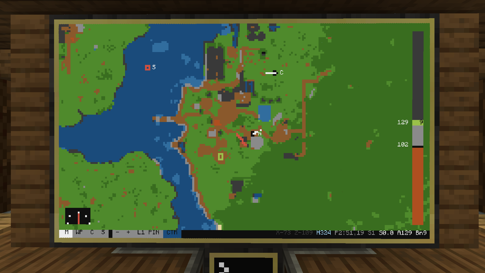
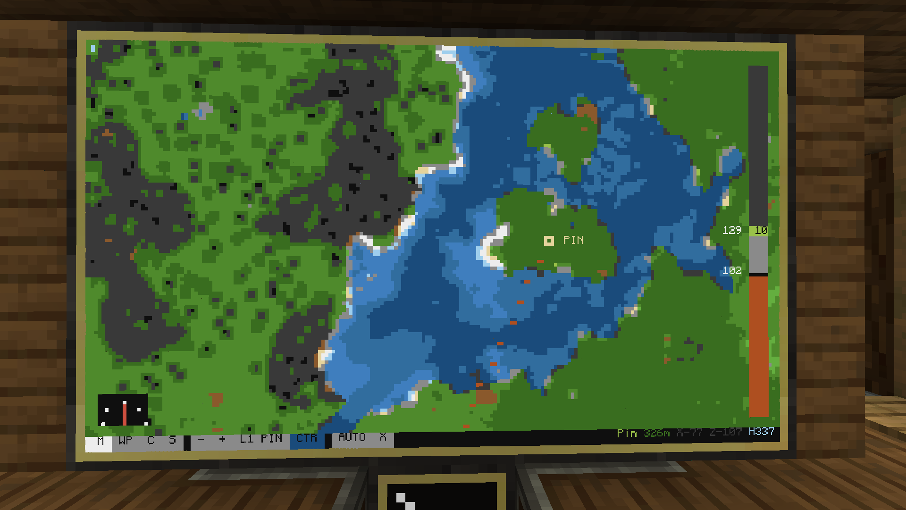
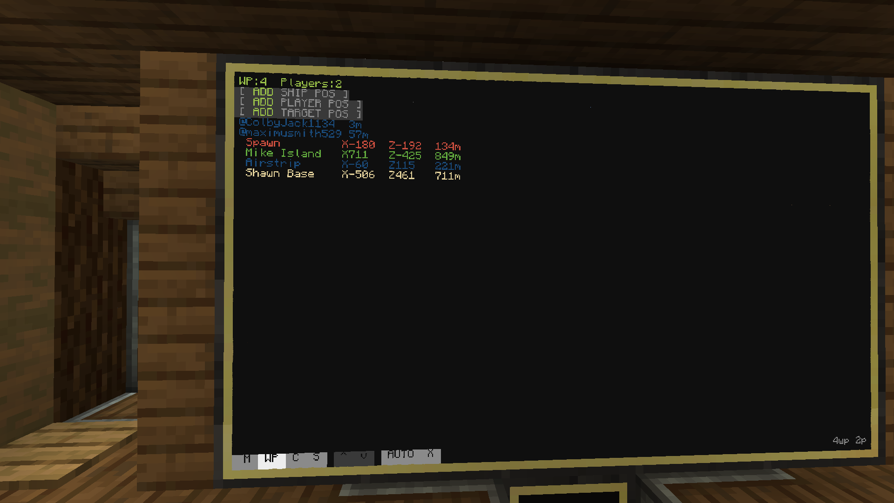
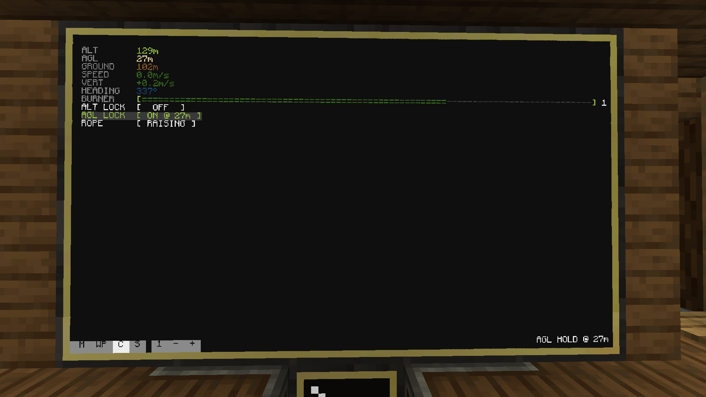
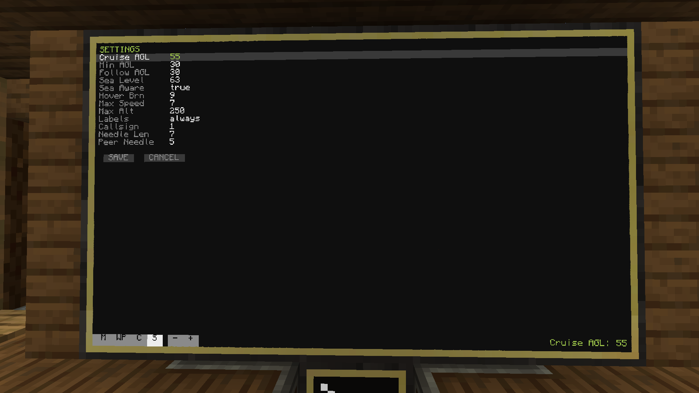
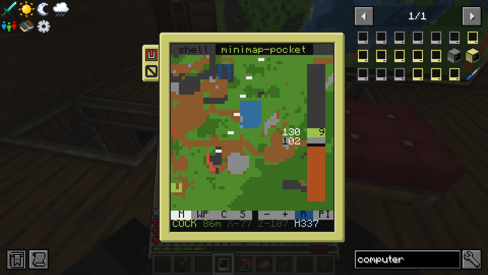
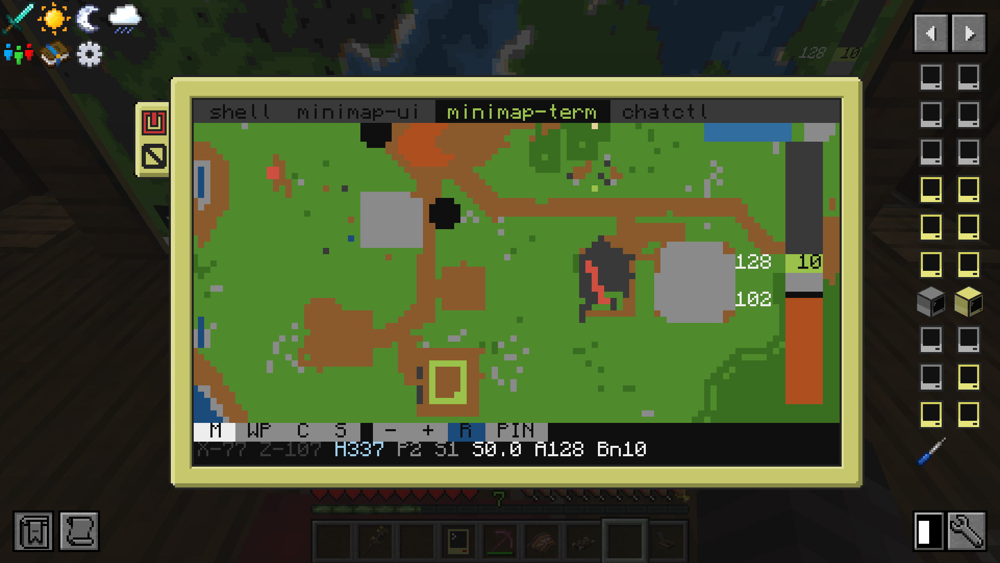
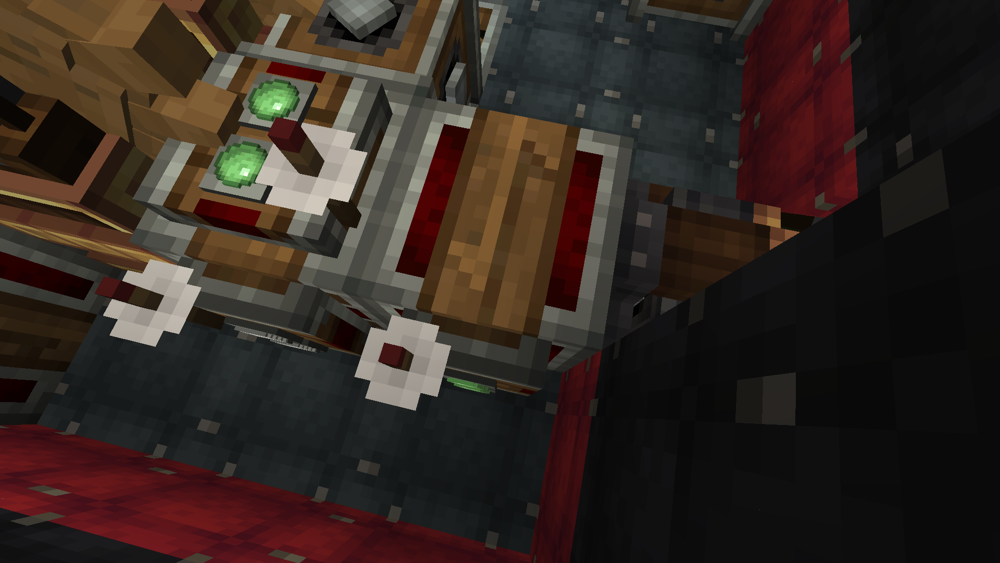
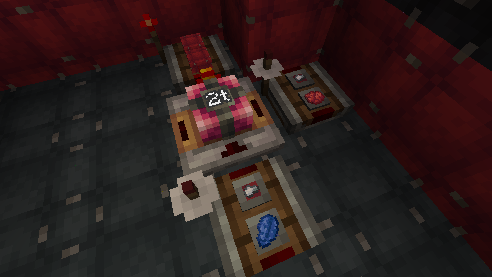

# CCMinimap

Minimap and autopilot software for Create Aeronautics airships using data from
BlueMap and in-game peripherals.

## Requirements

Server:

- [CC:Tweaked](https://tweaked.cc/)
- [Create Aeronautics](https://github.com/Sciecode/create-aeronautics)
- [BlueMap](https://bluemap.bluecolored.de/) running on your world. This provides the terrain and player data.

Host:
*The machine running CCMinimap's server-side components*

- Docker / Docker Compose
- Network access from the host to your BlueMap web server
- Network access from ComputerCraft to CCMinimap's server URL

In-game:

- [GPS constellation](https://tweaked.cc/guide/gps_setup.html)
- Advanced computer
- Ender modem
- `navigation_table` with a compass (for yaw)
- Redstone Links and Redstone Relays (for autopilot)
- Advanced monitors (optional)
- `altitude_sensor` (optional)
- `velocity_sensor` (optional)
- Ender Pocket Computer (optional)

## Screenshots















## Setup

### Host

Set up your `.env` file:

```sh
cp .env.example .env
```

Set the BlueMap URL, map id, and the URL your CC computers will use:

```sh
BLUEMAP_BASE_URL=http://your-bluemap-host:8100
BLUEMAP_MAP_ID=world
CLIENT_SERVER_URL=http://your-public-host:5055
```

Optionally, create the waypoint file:

```sh
cp waypoints.example.json waypoints.json
```

Start the server:

```sh
docker compose up -d --build
```

Health check:

```sh
curl http://your-public-host:5055/health
```

### In-game install

Install the startup script on an Advanced Computer on your airship:

```lua
wget http://your-public-host:5055/startup.lua startup.lua
reboot
```

The computer will now update itself and open CCMinimap on boot. Delete
`startup.lua` if you want to stop that.

You can also install on a pocket computer for remote control:

```lua
wget http://your-public-host:5055/startup-pocket.lua startup.lua
reboot
```

For security and remote control binding, set the same password on the ship and
pocket:

```lua
minimap password your-password-here
```

If you run more than one ship, give each ship a different `airshipName` in
`minimap.cfg`.

### In-game peripherals

At this point, CCMinimap can run with just GPS, an advanced computer, an ender
modem, BlueMap, and the CCMinimap server. It will be missing some core features
until more peripherals are added.

Peripherals can be placed next to the computer, or connected with modems and
networking cables.

Install a `navigation_table` on your ship and place a compass in it. This gives
CCMinimap the ship's yaw. If the needle points the wrong way, set
`headingOffset` in `minimap.cfg`; it is usually off by a multiple of 90 degrees.

You can add an `altitude_sensor` and `velocity_sensor` as well. These give more
accurate and more frequent Y-level and velocity updates, but GPS can provide
both values if the sensors are not present.

You can add a [Chat Box](https://docs.advanced-peripherals.de/0.8/peripherals/chat_box/)
from Advanced Peripherals to control the ship with chat commands.

### Autopilot

Autopilot requires `redstone_relay` peripherals and Redstone Links. The minimum
control set can fit on one relay using five links, or ten links counting the
receiving side.

Define those controls in `minimap.cfg` so CCMinimap knows which relay and side
drives each ship control. Right-click the modem attached to a redstone relay to
see its peripheral name.



In this example, the redstone relay has links on four sides. Each link controls
one direction: forward, back, turn left, or turn right. The computer sends a
signal to the relay, which controls a clutch or gearshift hooked up to a
propeller, similar to using a Linked Controller.


Burners can be controlled in two modes:

- `direct`: one redstone link directly controls the burner.
- `burner`: a redstone accumulator lets one signal add burner, one signal
  subtract burner, and one signal read the output value.

The accumulator takes more space, but still works with a Linked Controller if
the computer crashes or you want manual control. Set the mode with `liftMode`
in `minimap.cfg`. The default is `burner`.

An example accumulator setup is shown below:



### Custom controls

You can also add custom controls using any redstone toggle or pulse signal. For
example, a rope elevator can be raised or lowered through a gearshift. Define
these in `minimap.cfg` under `customControls`; the default config includes an
example.

## Features

- Live BlueMap minimap displayed on advanced monitors, in TERM, and in pocket computers
- UI with advanced controls such as pan and zoom and multiple tabs
- Ship position, heading, altitude, speed, and burner readouts
- Player, waypoint, pin, and peer-ship targets
- Autopilot to coordinates, waypoints, players, and look targets
- ALT hold and terrain-aware AGL hold
- Pocket remote over rednet
- Local terminal mirror on the ship computer
- Optional chat commands from one configured player

## Using It

The monitor UI has four tabs:

- `M`: map
- `WP`: players, waypoints, and local waypoint actions
- `C`: burner, holds, and custom controls
- `S`: common tuning values

Tap a player, waypoint, peer ship, or pin to select a target. `AUTO` flies to
the selected target. `STOP` stops the autopilot. `X` clears the target.

ALT hold locks to a fixed Y level. AGL hold locks to a height above BlueMap's
terrain sample. Autopilot handles horizontal movement, so ALT/AGL hold can be
used with or without `AUTO`.

The waypoint tab can save local waypoints from the ship position, a player
position, or the current target. Shared waypoints still come from
`waypoints.json` and BlueMap markers.

Before trusting autopilot, make sure GPS, heading, burner level, and relay
directions are all correct. If the ship turns the wrong way or cannot hold
altitude manually, fix that first.

## Commands

The CLI works on the ship, on the pocket, and through the optional chat bridge.

| Command | Action |
| --- | --- |
| `minimap goto X Z` | Fly to a coordinate |
| `minimap look [player] [distance]` | Fly to the block a player is looking at |
| `minimap wp <name>` | Fly to a named waypoint |
| `minimap burner N` | Set burner level, 0-15 |
| `minimap hold [altitude]` | Toggle fixed-altitude hold |
| `minimap agl [offset]` | Toggle height-above-ground hold |
| `minimap ctl <name> [on/off/toggle]` | Use a configured custom control |
| `minimap stop` | Stop autopilot, holds, and manual burner override |
| `minimap status` | Print position, heading, and mode |
| `minimap password [password]` | Set or clear the control password |
| `minimap help` | Show the command list |

For chat control, enable `chatControlEnabled`, set `playerName`, and attach a
`chat_box`. Commands start with `!minimap`:

```text
!minimap wp Base
!minimap stop
```

## Configuration

Files you will probably edit:

- `.env`: server settings
- `waypoints.json`: shared waypoints
- `minimap.cfg`: ship settings, created on first boot
- `minimap-pocket.cfg`: pocket settings, created on first boot

Common ship settings:

- `playerName`
- `airshipName`
- `hoverBurnerLevel`
- `cruiseAltitudeAboveGround`
- `minAltitudeAboveGround`
- `followAltitudeAboveGround`
- `seaLevelAwareAgl`
- `termMirrorEnabled`
- `chatControlEnabled`
- `customControls`

Most ships need some tuning. For lift you can adjust `hoverBurnerLevel` as well as lift PID values.

There are too many config options to list them all, but this was made to be as configurable as possible. If something is inverted or offset or needs tweaking, check the configs.


MIT licensed. See `LICENSE`.
